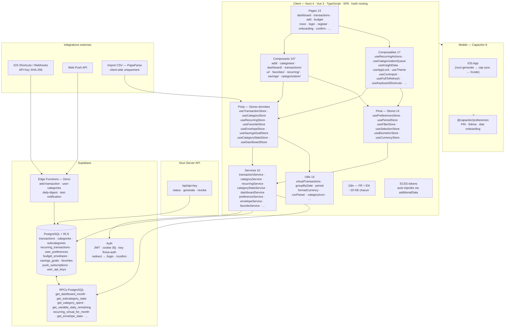
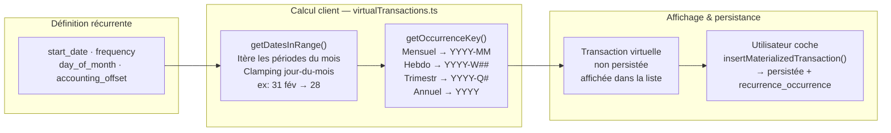
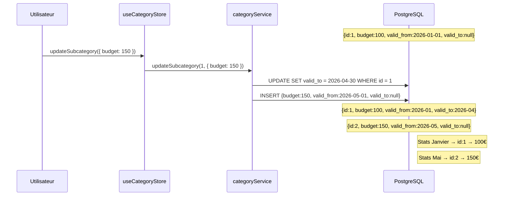

# Finixa

**Ajouter une dépense en moins de cinq secondes depuis son téléphone** — l'app de finances personnelles mobile-first construite autour de cette seule contrainte.

[](https://nuxt.com)
[](https://vuejs.org)
[](https://www.typescriptlang.org)
[](https://supabase.com)
[](https://capacitorjs.com)
[](https://app.finixa.net/)

**[→ App (app.finixa.net)](https://app.finixa.net/)** · **[→ Landing (finixa.net)](https://finixa.net/)** · **[→ Étude de cas complète sur mon portfolio](https://owenlebec.fr/projects/finixa)**

---

## Contexte

Finixa est une app de finances personnelles en usage réel au quotidien, centrée sur une contrainte UX précise : **ajouter une dépense le plus vite possible depuis un mobile**. Elle couvre le suivi de dépenses et revenus, la gestion de budgets par catégorie et sous-catégorie, le budget par enveloppe (50/30/20), les transactions récurrentes virtuelles, et des statistiques mensuelles calculées via des RPCs PostgreSQL. L'app est packagée pour iOS/Android via Capacitor en plus du déploiement web, et continue d'évoluer activement.

## Fonctionnalités clés

- Ajout de transaction en quelques secondes, montants signés en base (`-50` = dépense, `+1000` = revenu)
- Budgets par catégorie et sous-catégorie, avec historique versionné (voir plus bas)
- Budget par enveloppe (méthode 50/30/20)
- Transactions récurrentes calculées virtuellement, matérialisées seulement quand l'utilisateur les valide
- Statistiques mensuelles agrégées côté PostgreSQL (aucune logique de stats côté client)
- Import CSV côté client (PapaParse)
- Ajout de transaction externe via clé API (ex. raccourci iOS Shortcuts)
- Digest quotidien et push notifications via Edge Functions
- Localisation complète FR/EN
- Packaging iOS/Android via Capacitor, avec verrouillage par PIN et stockage sécurisé local

## Stack technique

| Techno | Rôle |
|---|---|
| Nuxt 4 + Vue 3 (SPA, hash routing) | SSR désactivé intentionnellement — le hash routing est requis pour la compatibilité Capacitor (`capacitor://` ne supporte pas le push-state routing) |
| TypeScript strict | `TransactionType ('depense' \| 'revenu' \| 'epargne')` comme discriminant central, de la base jusqu'aux composants |
| Pinia (15 stores) | Architecture en trois couches : `app/services/` isole Supabase, les stores détiennent l'état, les composants consomment les stores |
| Supabase (PostgreSQL + Auth + RLS) | Row Level Security sur toutes les tables ; vues calculées exposées en RPCs PostgreSQL |
| Edge Functions (Deno) | 4 fonctions serverless : ajout de transaction par clé API, digest quotidien, push notifications, listing de catégories |
| SCSS custom (design system par tokens) | Pas de Tailwind — tokens auto-injectés dans chaque composant via `additionalData` |
| Capacitor 8 | Packaging iOS/Android, `@capacitor/preferences` pour le stockage local sécurisé |
| @nuxtjs/i18n | FR/EN, stratégie `no_prefix` compatible hash routing |

## Architecture

### Vue d'ensemble



### Récurrences virtuelles et matérialisation lazy

Les transactions récurrentes ne sont pas persistées en base par défaut. À chaque chargement, `getDatesInRange()` calcule les occurrences sur la période et `getOccurrenceKey()` génère un identifiant stable ; seules les occurrences non encore enregistrées sont affichées comme "virtuelles". La persistance n'a lieu que lorsque l'utilisateur coche une occurrence. `getDatesInRange()` gère le clamping des jours-du-mois (ex. mensuel le 31 → 28 fév.) et tous les cas limites de fréquences hebdomadaires, trimestrielles et annuelles.



### Versioning des budgets de sous-catégories

Modifier un budget ne réécrit pas l'historique : une nouvelle ligne est créée avec `valid_from`, l'ancienne est fermée avec `valid_to`. Les requêtes de stats utilisent la date pour trouver le budget en vigueur à cette époque — les statistiques de janvier restent exactes même si le budget a changé en mai.



D'autres schémas (flux d'ajout de transaction, décalage date d'opération/date comptable, authentification par clé API, design system SCSS) sont disponibles dans l'[étude de cas complète](https://owenlebec.fr/projects/finixa).

## Points techniques notables

- **Trois couches strictes** — aucun appel Supabase direct dans un composant : composants → stores → services → Supabase, sans exception.
- **RPCs PostgreSQL pour toutes les agrégations** — aucune logique de stats côté front ; `get_subcategory_stats`, `get_variable_daily_remaining`, `recurring_virtual_for_month`, etc. sont des fonctions SQL appelées via `supabase.rpc()`.
- **Récurrences virtuelles** — la partie la plus complexe du projet : occurrences calculées à la volée sur n'importe quelle fenêtre temporelle, avec clamping des jours-du-mois, matérialisées seulement quand l'utilisateur les valide.
- **Versioning des budgets** — repenser le schéma pour que les requêtes de stats restent déterministes quelle que soit la période historique interrogée, sans jamais réécrire une ligne existante.
- **Date d'opération vs date comptable** — chaque transaction a une `date` et une `accounting_date` nullable ; pour les récurrentes en `accounting_offset: 'next_month'`, la date comptable est fixée au 1er du mois suivant à la matérialisation (un prélèvement le 28 décembre compte sur le budget de janvier).
- **Authentification par clé API** — les Edge Functions exposent des endpoints authentifiés par SHA-256 d'une clé générée par l'utilisateur, pour ajouter une transaction depuis un raccourci iOS Shortcuts sans exposer les credentials Supabase.
- **Design system SCSS par tokens** — palette primitive jamais référencée directement dans les composants ; seules des propriétés CSS sémantiques (`--color-bg`, `--color-accent`, ...) y sont utilisées, auto-injectées via `additionalData` dans `nuxt.config.ts`.

## Cloner et lancer en local

Prérequis : **Node.js 20+**, un projet [Supabase](https://supabase.com) (gratuit).

```bash
git clone https://github.com/OwenLB/finixa.git
cd finixa
npm install
```

Copier `.env.example` en `.env` et renseigner les variables :

```env
SUPABASE_URL=https://<project-ref>.supabase.co   # URL du projet Supabase
SUPABASE_KEY=sb_publishable_...                   # Clé publishable (anon), côté client
SUPABASE_SECRET_KEY=sb_secret_...                 # Clé secrète (service role), utilisée côté serveur par les routes Nitro server/api/api-key/*
VITE_VAPID_PUBLIC_KEY=                            # Clé publique VAPID pour les push notifications (optionnel)
RESEND_API_KEY=                                   # Clé API Resend, emails transactionnels (optionnel en local)
```

```bash
npm run dev         # Serveur de dev — http://localhost:3000
npm run build        # Build production
npm run generate      # Génération statique (requis avant Capacitor)
npm run test          # Tests unitaires/composants (Vitest)
npm run test:e2e      # Tests end-to-end (Playwright)
npm run cap:ios       # nuxt generate + cap sync + ouverture Xcode
```

Un site vitrine séparé (Astro, déployé sur [finixa.net](https://finixa.net/)) vit dans `landing/` — voir `landing/README.md`.

## Structure du projet

```
app/
  pages/          → 13 pages (dashboard, transactions, add, budget, onboarding, ...)
  components/      → add/ · categories/ · dashboard/ · transactions/ · ui/ · favorites/ · recurring/ · savings/
  composables/      → useRecurringActions, useCategorizationQueue, useAppLock, useTheme, ...
  stores/           → 15 stores Pinia (données + UI), voir architecture ci-dessus
  services/         → couche d'accès Supabase, un fichier par domaine
  utils/            → virtualTransactions, groupByDate, formatCurrency, csvParser, ...
server/api/         → /api/api-key (status, generate, revoke)
supabase/            → migrations SQL, RPCs, policies RLS
landing/             → site vitrine Astro séparé (finixa.net)
ios/                 → projet Xcode généré par Capacitor
e2e/                 → tests Playwright
```

## Voir le projet en contexte

Cette étude de cas détaille les choix produit, l'architecture complète et des captures d'écran : **[owenlebec.fr/projects/finixa](https://owenlebec.fr/projects/finixa)**

Plus de projets sur [owenlebec.fr](https://owenlebec.fr).
