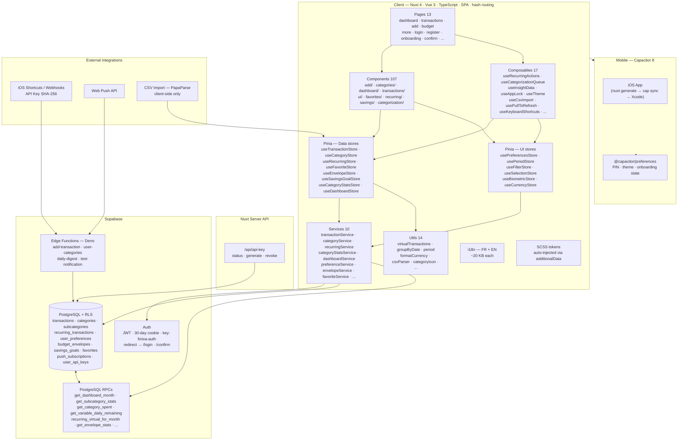
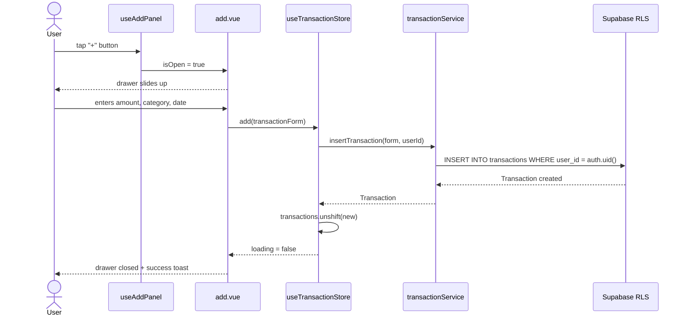
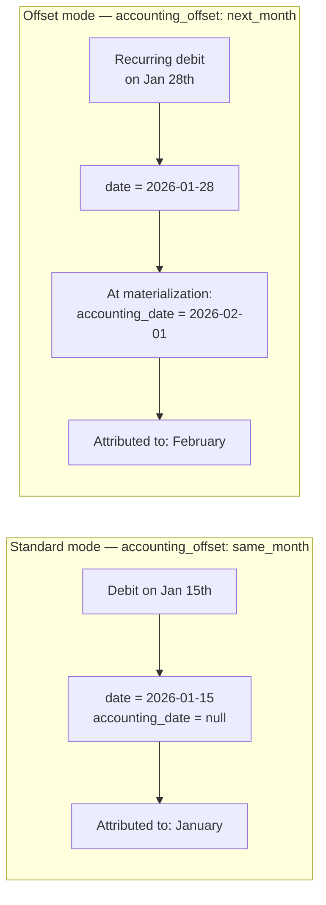
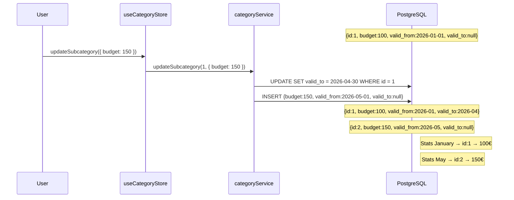
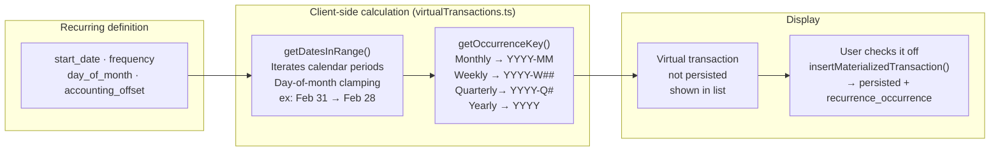
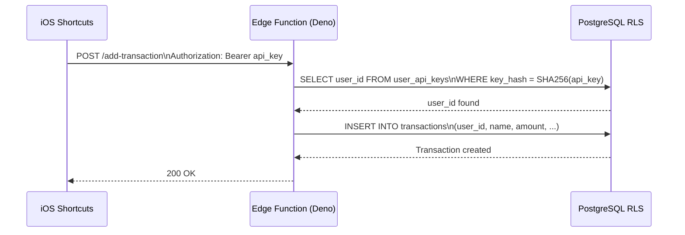
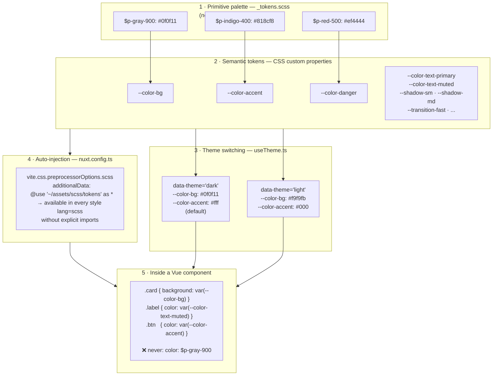

## Context

Finixa is a personal finance SaaS MVP built around one hard UX constraint: **add an expense as fast as possible from a mobile device**. It covers expense and income tracking, per-category and per-subcategory budgeting, envelope budgeting (50/30/20), virtual recurring transactions, and monthly statistics backed by PostgreSQL RPCs. The app is packaged for iOS/Android via Capacitor in addition to the web deployment.

## Stack & Architecture

- **Nuxt 4 + Vue 3 (SPA, hash routing)** — SSR is intentionally disabled: hash-based routing is required for Capacitor compatibility, as the `capacitor://` scheme does not support push-state routing.
- **Strict TypeScript** — Amounts are signed at the database level (`-50` = expense, `+1000` = income). The central discriminant is `TransactionType ('depense' | 'revenu' | 'epargne')`, used consistently from the database schema up to UI components.
- **Pinia (15 stores)** — Three-layer architecture: `app/services/` isolates all Supabase calls, stores hold state and expose mutations, pages and components consume stores. No direct Supabase calls in components.
- **Supabase (PostgreSQL + Auth + RLS)** — Row Level Security on every table. Computed views (stats, virtual recurrences) are PostgreSQL RPCs called directly from the service layer.
- **Edge Functions (Deno)** — Four serverless functions for external integrations: quick transaction insertion via API key, daily digest, push notifications, category listing endpoint.
- **Custom SCSS (token-based design system)** — No Tailwind. Design tokens are auto-injected into every component via `additionalData` in `nuxt.config`. Components use only semantic CSS custom properties.
- **Capacitor 8** — iOS/Android packaging, `@capacitor/preferences` for secure local storage (PIN, theme, onboarding state).
- **@nuxtjs/i18n** — Full FR/EN localization, `no_prefix` strategy compatible with hash routing.

## Detailed Architecture

## Notable Technical Points

### 1 · Transaction add flow

The full sequence from button tap to reactive UI update — the layer separation in action.

### 2 · Operation date vs accounting date

Each transaction has a `date` (when the operation occurs) and a nullable `accounting_date` (when it is attributed to the budget). For recurring transactions with `accounting_offset: 'next_month'`, the accounting date is set to the 1st of the following month at materialization time.

Concrete use case: a subscription debited on December 28th but counted against January's budget.

### 3 · Subcategory budget versioning

Editing a budget does not rewrite history: a new row is created with `valid_from`, the old one is closed with `valid_to`. Stats queries use the date to find the budget that was in effect at that point in time.

### 4 · Virtual recurrences and lazy materialization

Recurring transactions are not persisted in the database by default. On every load, `getDatesInRange()` computes occurrences for the current period and `getOccurrenceKey()` generates a stable identifier. Only unmatched occurrences are shown as "virtual" rows. Persistence only happens when the user checks off an occurrence.

### 5 · PostgreSQL RPCs for all aggregations

No stats logic on the frontend. All computed views are SQL functions: `get_subcategory_stats`, `get_variable_daily_remaining`, `recurring_virtual_for_month`, etc. Called via `supabase.rpc()` from the service layer.

### 6 · API key system for external integrations

Deno Edge Functions expose endpoints authenticated via a SHA-256 hash of a user-generated key. This allows adding a transaction from an iOS Shortcuts automation without exposing Supabase credentials.

## SCSS Design System

Tokens are defined in two layers: a primitive palette (never referenced directly in components) and semantic CSS custom properties (the only layer components may use). The token file is **auto-injected** into every `<style lang="scss">` block via `additionalData` in `nuxt.config.ts` — no manual imports needed.

## What I Learned / Contributed

The most challenging part was the recurring transactions engine: computing stable virtual occurrences over any arbitrary time window, with day-of-month clamping (e.g., monthly on the 31st → Feb 28/29), while cleanly handling the split between operation date and accounting date. Budget versioning required rethinking the schema so that stats queries are deterministic regardless of which historical period is queried.
