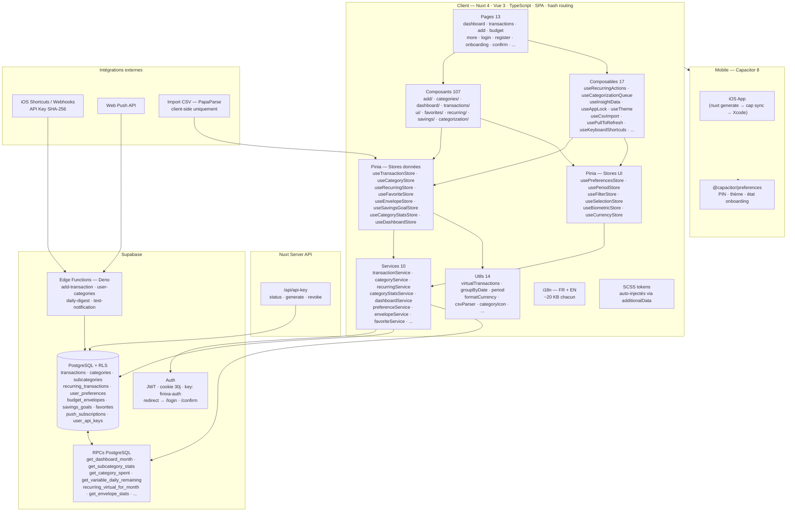
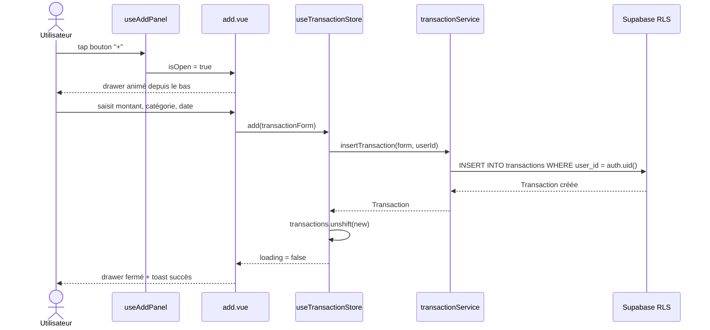
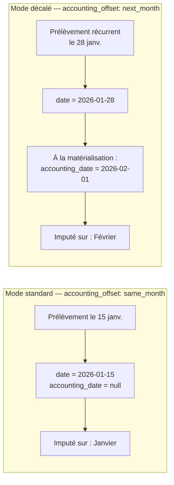
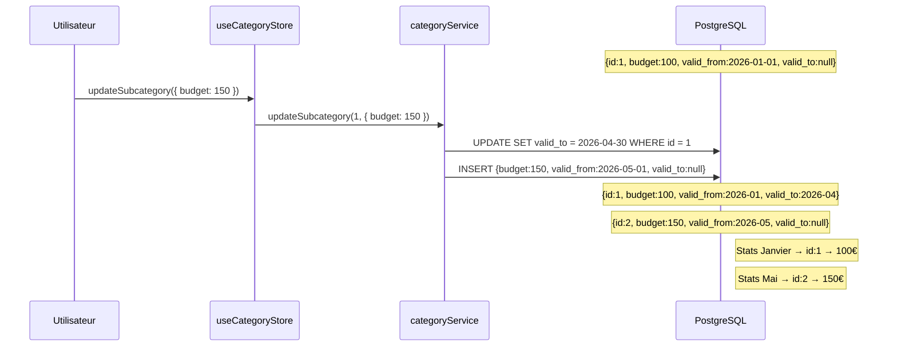
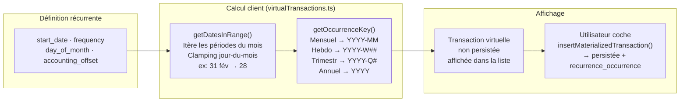
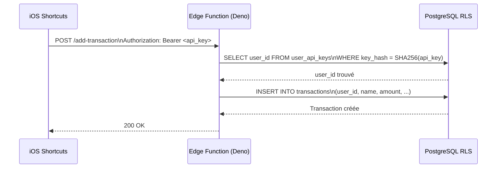
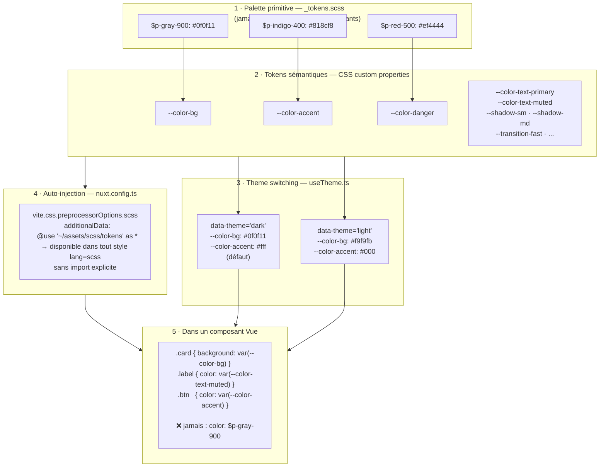

## Contexte

Finixa est un MVP de SaaS de finances personnelles centré sur une contrainte UX précise : **ajouter une dépense le plus vite possible depuis un mobile**. Le projet couvre le suivi de dépenses et revenus, la gestion de budgets par catégorie et sous-catégorie, le budget par enveloppe (50/30/20), les transactions récurrentes virtuelles, et des statistiques mensuelles avec RPCs PostgreSQL. L'app est packagée pour iOS/Android via Capacitor en plus du déploiement web.

## Stack & Architecture

- **Nuxt 4 + Vue 3 (SPA, hash routing)** — SSR désactivé intentionnellement : le hash routing est nécessaire pour la compatibilité Capacitor, le protocole `capacitor://` ne supportant pas le push-state routing.
- **TypeScript strict** — Les montants sont signés en base (`-50` = dépense, `+1000` = revenu). Le discriminant central est `TransactionType ('depense' | 'revenu' | 'epargne')`, utilisé de la base de données jusqu'aux composants.
- **Pinia (15 stores)** — Architecture en trois couches : `app/services/` isole les appels Supabase, les stores détiennent l'état et exposent les mutations, les pages et composants consomment les stores. Aucun appel Supabase direct dans les composants.
- **Supabase (PostgreSQL + Auth + RLS)** — Row Level Security sur toutes les tables. Les vues calculées (stats, récurrences virtuelles) sont des RPCs PostgreSQL appelées directement depuis les services.
- **Edge Functions (Deno)** — Quatre fonctions pour les intégrations externes : ajout rapide de transaction via API key, digest quotidien, push notifications, listing de catégories.
- **SCSS custom (design system par tokens)** — Pas de Tailwind. Les tokens sont auto-injectés dans chaque composant via `additionalData` dans `nuxt.config`. Les composants utilisent uniquement des CSS custom properties sémantiques.
- **Capacitor 8** — Packaging iOS/Android, `@capacitor/preferences` pour le stockage local sécurisé (PIN, thème, onboarding).
- **@nuxtjs/i18n** — Localisation complète FR/EN, stratégie `no_prefix` compatible hash routing.

## Architecture détaillée

## Points techniques notables

### 1 · Flux d'ajout de transaction

Du tap sur le bouton jusqu'à la mise à jour réactive de l'interface — la séparation des couches en action.

### 2 · Date d'opération vs date comptable

Chaque transaction a une `date` (quand l'opération a lieu) et une `accounting_date` (nullable, quand elle est imputée au budget). Pour les récurrentes avec `accounting_offset: 'next_month'`, la date comptable est fixée au 1er du mois suivant lors de la matérialisation.

Cas d'usage concret : un abonnement prélevé le 28 décembre mais comptabilisé sur le budget de janvier.

### 3 · Versioning des budgets de sous-catégories

Modifier un budget ne réécrit pas l'historique : une nouvelle ligne est créée avec `valid_from`, l'ancienne est fermée avec `valid_to`. Les requêtes de stats utilisent la date pour trouver le budget en vigueur à cette époque.

### 4 · Récurrences virtuelles et matérialisation lazy

Les transactions récurrentes ne sont pas persistées en base par défaut. À chaque chargement, `getDatesInRange()` calcule les occurrences sur la période et `getOccurrenceKey()` génère un identifiant stable. Seules les occurrences non encore enregistrées sont affichées comme "virtuelles". La persistance n'a lieu que lorsque l'utilisateur coche une occurrence.

### 5 · RPCs PostgreSQL pour toutes les agrégations

Aucune logique de stats côté front. Toutes les vues calculées sont des fonctions SQL : `get_subcategory_stats`, `get_variable_daily_remaining`, `recurring_virtual_for_month`, etc. Appelées via `supabase.rpc()` depuis les services.

### 6 · Système d'API key pour intégrations externes

Les Edge Functions Deno exposent des endpoints authentifiés par SHA-256 d'une clé générée par l'utilisateur. Permet d'ajouter une transaction depuis un raccourci iOS Shortcuts sans exposer les credentials Supabase.

## Design system SCSS

Les tokens sont définis en deux couches : palette primitive (jamais utilisée directement dans les composants) et propriétés CSS sémantiques (seules utilisées dans les composants). Le fichier de tokens est **auto-injecté** dans chaque `<style lang="scss">` via `additionalData` dans `nuxt.config.ts` — aucun import manuel nécessaire.

## Ce que j'ai appris / apporté

La partie la plus complexe a été la logique de récurrences : calculer des occurrences virtuelles stables sur n'importe quelle fenêtre temporelle, avec clamping des jours (ex. mensuel le 31 → 28 fév.), tout en gérant la désynchronisation entre date d'opération et date comptable. Le versioning des budgets en base a nécessité de repenser le schéma pour que les requêtes de stats soient déterministes quelle que soit la période interrogée.
